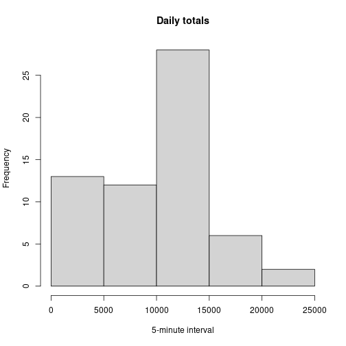
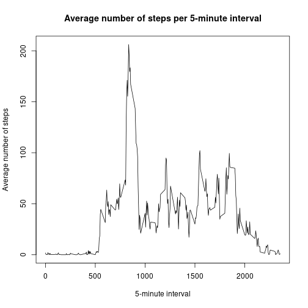
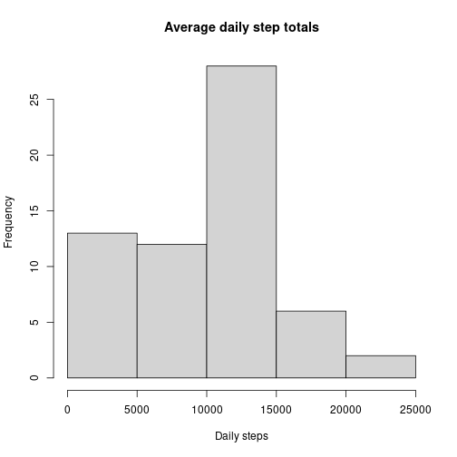
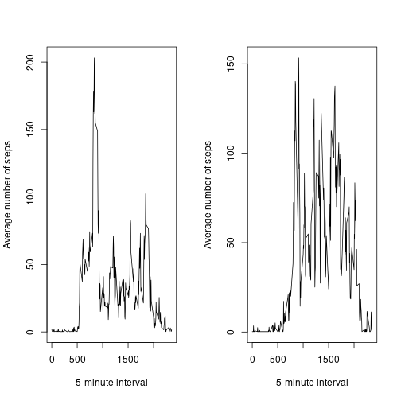

## Loading and preprocessing the data


```r
knitr::opts_chunk$set(echo = TRUE)
help(knit2html)
library(magrittr)
library(dplyr)
activity<-read.csv("~/RStudio/activity.csv")
```


```r
#Make a histogram of steps per day

hist(daily_totals$steps, xlab="5-minute interval", main="Daily totals")
```



## What is mean total number of steps taken per day?

```r
print(paste("The mean number of steps is", mean(daily_totals$steps)))
```

```
## [1] "The mean number of steps is 9419.08072997216"
```

```r
print(paste("The median number of steps is", median(daily_totals$steps)))
```

```
## [1] "The median number of steps is 10395"
```


## What is the average daily activity pattern?


```r
group_means<- aggregate(steps~interval, activity, mean, na.rm=TRUE)
plot(group_means$interval, group_means$steps, xlab="5-minute interval", ylab="Average number of steps", main="Average number of steps per 5-minute interval", type="l")
```



```r
print(group_means[104,])
```

```
##     interval    steps
## 104      835 206.1698
```

```r
print(paste("The 5-minute interval with the highest number of average steps is",
            group_means[104,1], "."))
```

```
## [1] "The 5-minute interval with the highest number of average steps is 835 ."
```


## Imputing missing values


```r
activity_sub<-subset(activity, is.na(activity$steps)==1)
print(paste("There are", nrow(activity_sub), 
            "rows with missing values in the activity dataset"))
```

```
## [1] "There are 2304 rows with missing values in the activity dataset"
```

```r
activity$steps[is.na(activity$steps)==1]<-first(group_means[group_means$interval==activity$interval, 2])
```


```r
daily_totals<-aggregate(steps~date, activity, sum)

hist(daily_totals$steps, xlab="Daily steps", main="Average daily step totals")
```



## Are there differences in activity patterns between weekdays and weekends?

```r
print("The missing data heavily skewed the histogram of daily total steps, so it was 
a good idea to replace the missing values.")
```

```
## [1] "The missing data heavily skewed the histogram of daily total steps, so it was \na good idea to replace the missing values."
```


```r
activity$date<-as.Date(activity$date)
activity$day_type=ifelse(weekdays(activity$date)=="Saturday"|weekdays(activity$date)=="Sunday","Weekend", "Weekday")
```


```r
weekday_subset<-activity[activity$day_type=="Weekday", ]
weekend_subset<-activity[activity$day_type=="Weekend", ]
weekday_totals<-aggregate(steps~interval, weekday_subset, mean, na.rm=TRUE)
weekend_totals<-aggregate(steps~interval, weekend_subset, mean, na.rm=TRUE)


parameter<-par(mfrow=c(1,2))
parameter<-plot(weekday_totals$interval, weekday_totals$steps, 
               xlab="5-minute interval", ylab="Average number of steps",
               type="l")
parameter<- plot(weekend_totals$interval, weekend_totals$steps, 
                 xlab="5-minute interval", ylab="Average number of steps",
                 type="l")
```


